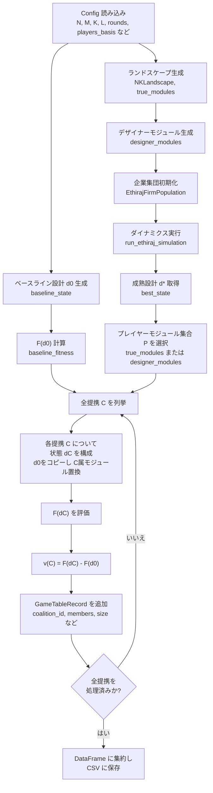
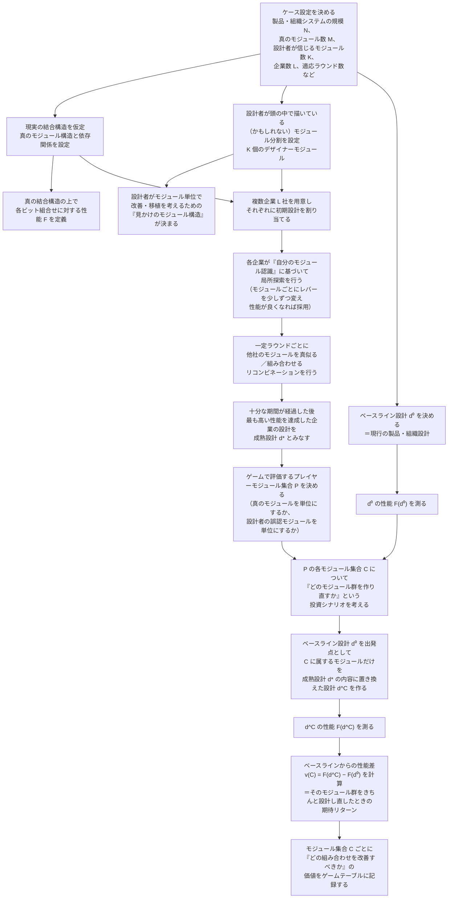

# 詳細設計（Ethiraj & Levinthal 2004 シナリオ）

## 1. Config 拡張
```text
@dataclass
class EthirajSettings:
    true_modules: int
    designer_modules: int
    players_basis: Literal['true','designer']
    intra_density: float
    inter_density: float
    firms: int
    rounds: int
    recombination_interval: int
    recombination_mode: Literal['firm','module','hybrid']
    baseline_state: str
```
- `ExperimentConfig.ethiraj: Optional[EthirajSettings]` を追加。
- YAML: `scenario.type=ethiraj2004` と `ethiraj:` セクションを必須とする。

## 2. ランドスケープ生成
- `EthirajLandscapeFactory`:
```python
def build(N, M, intra, inter, seed) -> tuple[NKLandscape, list[list[int]]]
```
  - 各モジュール `M_k` の要素数をできるだけ均等に分配。
  - 依存関係: `K_i` = neighbors sampled prioritizing same module with prob `intra`, otherwise cross-module `inter` density。
  - 各ビットの依存候補から `NKLandscape` を構築（`dependencies`, `tables`）。
  - 戻り値: `NKLandscape`, `true_modules` (list of bit indices per module)。

## 3. デザイナー構造
- `build_designer_modules(N, K)`
  - 均等割り / YAML 指定をサポート。
  - `designer_modules: list[list[int]]`。
  - `players_basis` が `designer` の場合はこちらをプレイヤ集合として使用。

## 4. Dynamics
### Data structures
```python
@dataclass
class EthirajFirmPopulation:
    states: np.ndarray  # shape (L, N)
    module_assignments: list[list[int]]  # designer modules
    landscape: NKLandscape
```
- `module_fitness(state, module_idx)` = 平均 `f_i` over module bits。
- `local_search_step()`:
  1. For each firm ℓ and module D_k:
     - pick `bit` in D_k at random.
     - toggle bit; compute `module_fitness` using landscape (`evaluate_module`).
     - accept if improved.
- `recombine(mode, top_fraction)`:
  - `firm`: rank firms by `F(state)`; pick donors to copy random module.
  - `module`: for each module, select firm with best module fitness and copy module bits into others with prob.
  - `hybrid`: combination of above.

Implementation simplification: use deterministic copy from best firm(s) each interval.

### Simulation run
```python
def run_simulation(population, rounds, recomb_interval, mode) -> EthirajSimulationResult:
    history = []
    for t in range(rounds):
        population.local_search_step()
        if (t+1) % recomb_interval == 0:
            population.recombine(mode)
        history.append(population.metrics())
    return EthirajSimulationResult(best_state, baseline_state, history)
```
- `best_state` = state with highest global fitness.
- `baseline_state` = zeros vector or config-provided string.

## 5. ゲームテーブル
- `EthirajGameTableBuilder`:
```python
class EthirajGameTableBuilder:
    def __init__(landscape, modules, baseline_state, mature_state): ...
    def build_table():
        for coalition in all subsets modules:
            state = baseline_state.copy()
            for module in coalition:
                for bit in module:
                    state[bit] = mature_state[bit]
            F_dS = landscape.evaluate(state)
            v_value = F_dS - baseline_fitness
```
- `GameTableRecord` (from `cmis_nk.common.game_types`) reused with `mean_value = v_value`, `std_value=0`, `notes` storing scenario+module basis。

### 5.1 ゲームテーブル生成フロー（フローチャート）

Ethiraj シナリオにおけるゲームテーブル生成の処理フローを、アルゴリズム的なフローチャートとして整理すると以下のようになる。



このフローに従うことで、「(d⁰, d*) とプレイヤーモジュール集合 P」から、各提携 C の v(C) を系統的に計算してゲームテーブルを構築する。

### 5.2 ゲームテーブル生成フロー（意味的フローチャート）

同じ処理を、Ethiraj & Levinthal (2004) の「ほぼ分解可能システム＋モジュール誤認」の組織設計ストーリーとして意味的に読み替えたフローチャートは次のとおり。



この意味的フローチャートでは、d⁰ / d* をそれぞれ「現行設計」と「設計者のモジュール認識のもとで長期に適応した設計」として解釈し、  
「どのモジュール集合を優先的に作り直せば、システム性能がどれだけ改善するか」を投資判断の観点から読むことを意図している。

## 6. Pipeline Integration
- Add `_run_ethiraj_experiment(exp)` in `pipeline.py` analogous to other scenario branches.
- Steps:
  1. Build landscape + true modules.
  2. Build designer modules.
  3. Initialize firm population (random states respecting baseline if desired).
  4. Run simulation for `ethiraj.rounds`.
  5. Determine mature state (global best) and baseline state.
  6. Choose player modules (true or designer) for coalition evaluation.
  7. Build `EthirajGameTableBuilder` and export CSV.

## 7. 出力
- Path: `outputs/tables/ethiraj2004_baseline.csv`.
- Notes include scenario name, M/K, recombination_mode, and seeds.
- Optionally store time-series metrics to `outputs/logs/ethiraj2004_baseline_history.csv`.

## 8. 実世界での読み替え

- `true_modules` は、現実の技術システムや組織プロセスの「実際の結合構造」に対応し、`designer_modules` は設計者が頭の中で想定している分割単位を表す。
- ダイナミクスで生成される d⁰ / d* は、それぞれ「ベースライン設計」と「設計者のモジュール認識のもとで長期に適応した設計」として解釈できる。
- ゲームテーブルのプレイヤ（modules）は、現実には「どのモジュール群をちゃんと設計し直せば、全体性能がどれだけ伸びるか」を評価するための単位であり、
  v(S) = F(d^S) − F(d⁰) は、そのモジュール集合 S に対する設計投資の“期待リターン”として読める。
