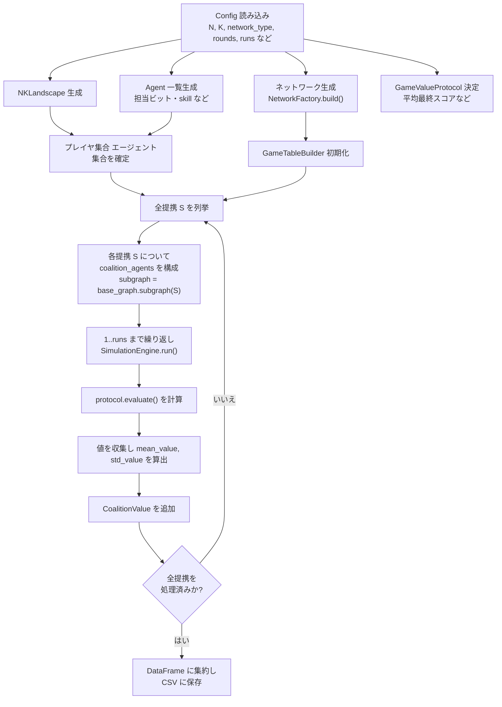
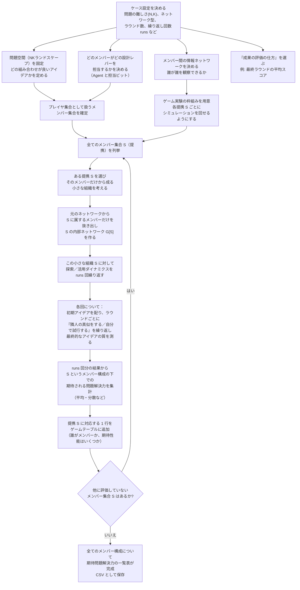

# 詳細設計

## 1. NKLandscape
```text
class NKLandscape:
    N: int
    K: int
    dependencies: list[list[int]]
    tables: list[np.ndarray]
    skill_profile: dict[str, tuple[float, float]]
    bit_skills: dict[int, str]
    conflict_pairs: set[tuple[int, int]]
```
- `from_random(N, K, rng, dependencies=None, skill_profile=None, bit_skills=None, conflict_pairs=None)`
  - デフォルトでは各 i の依存先をランダム生成。
  - `tables[i]` は長さ `2**(K+1)` の np.ndarray。
  - skill/bias: `bit_skills[i]` に紐づく `(low, high)` 範囲を適用。
  - conflict: 入力パターン内に conflict ペアが揃った場合、`bias_value`（例: 0.05）を設定。
- `evaluate(state)`
  - state: np.ndarray shape (N,) int8。
  - 各 i について index をビット連結で計算しテーブル値を取得。
  - 平均して `float` を返す。

## 2. Agent とユーティリティ
```text
@dataclass
class Agent:
    agent_id: int
    bits: list[int]
    name: str
    skill: str | None
    player_id: str
```
- `Agent.create_default(i)` → bits=[i], skill=None。
- 初期戦略は `AgentState` に保持：
```text
class AgentState:
    agent: Agent
    belief: np.ndarray  # Nビット
```
- `initialize_states(agents, N, seed=None, init='random')` で全エージェントの belief を生成。

## 3. ネットワーク
```text
class NetworkFactory:
    @staticmethod
def build(network_type, num_agents, **params) -> nx.Graph
```
- `LINE`: path graph。
- `COMPLETE`: complete_graph。
- `RANDOM`: erdos_renyi (p)。
- `SMALL_WORLD`: watts_strogatz (k, beta)。
- 乱数種 `seed` を受け取り networkx に渡す。

## 4. 探索・活用ダイナミクス
```text
@dataclass
class SimulationConfig:
    rounds: int
    velocity: float
    error_rate: float
    mode: Literal['generic','lf_pure']
    local_search_bits: Literal['assigned','all']
    accept_equal: bool
```
- `SimulationEngine`:
  - `states`: dict[agent_id, AgentState]
  - `history`: list[dict[str, Any]]
  - `run()`:
    1. 各ラウンドで `for agent in agents`:
       - 観察判定（velocity）。
       - 観察する場合：隣人のスコアを `landscape.evaluate(neighbor_state)` で比較。
       - 最良隣人が自分より良ければ模倣。コピー時に `error_rate` を適用。
       - それ以外は探索：担当ビット集合から 1 つ選び、反転して改善すれば採用（accept_equal=False の場合は strictly better のみ）。
    2. ラウンド終了時に `history` に平均/最大スコアを記録。
  - 返却: `SimulationResult`
```text
@dataclass
class SimulationResult:
    history: list[dict[str, float]]
    final_scores: dict[int, float]
    best_score: float
    best_state: np.ndarray
```
- LFモードでは `local_search_bits='assigned'`, `velocity=1.0`, `error_rate=0.0` 等をプリセット。

## 5. ゲームテーブル
```text
@dataclass
class CoalitionValue:
    coalition: tuple[int, ...]
    members: list[str]
    size: int
    mean_value: float
    std_value: float
    runs: int
    notes: str
```
- `GameValueProtocol` 抽象基底クラス
```python
class GameValueProtocol(Protocol):
    def evaluate(self, sim_result: SimulationResult, coalition_agents: list[Agent]) -> float: ...
```
- 既定実装: `AverageFinalScoreProtocol` → coalition の `final_scores` を平均。
- `GameTableBuilder`:
  - `build_table()`:
    - 全提携をビット列で列挙。
    - 各提携で `subgraph = base_graph.subgraph(coalition_nodes)`。
    - `runs` 回 SimulationEngine を実行し、protocol の値を収集。
    - `CoalitionValue` を蓄積して `pandas.DataFrame` に変換。
  - `to_csv(path)` で保存。

### 5.1 ゲームテーブル生成フロー（フローチャート）

Lazer シナリオでのゲームテーブル生成処理をフローチャートとして表す。



このフローにより、エージェントネットワークと探索ダイナミクスから、各提携 S の期待探索性能 v(S) をゲームテーブルとして体系的に計算できる。

### 5.2 ゲームテーブル生成フロー（意味的フローチャート）

同じ処理を、Lazer & Friedman (2007) の「ネットワーク × 探索／活用」モデルの文脈で意味的に読み替えたフローチャートは次のとおり。



この意味的フローチャートでは、各提携 S を「そのメンバーだけで組織を作った場合に、ネットワークを通じてどこまで良いアイデアに到達できるか」を測る実験として解釈している。

## 6. 設定ファイル
- `config/lazer2007_baseline.yml`
  - N, K, network_type, p/k/beta, rounds, runs, protocol 名など。
- ローダー `cmis_nk.config_loader` で YAML を読み込み、`ExperimentConfig` にマッピング。

## 7. 出力
- `outputs/tables/` にゲームテーブル CSV。
- `outputs/logs/` にシミュレーションメトリクス（JSON）を保存可能なヘルパーを設計。

## 8. 実世界での読み替え

- `Agent` クラスは、現実の「個人・役割」（例: プロジェクトメンバー、部署の代表者など）を表す。ネットワーク上のノードとして実装され、模倣／探索を通じてアイデアを更新する主体である。
- `NKLandscape` 上の各ビットは「設計選択肢（0/1）」であり、エージェントは自分が担当するビット集合 T(a) の値を変えることで探索を行う。ネットワークの構造は「誰が誰のアイデアにアクセスできるか」を表現する。
- ゲームテーブルの `members` 列は「提携を構成するエージェント集合 S」を意味し、v(S) は「そのメンバーだけで構成された組織が、ネットワークを通じてどれだけ優れた解に到達しうるか」という問題解決能力（期待性能）を表す。
