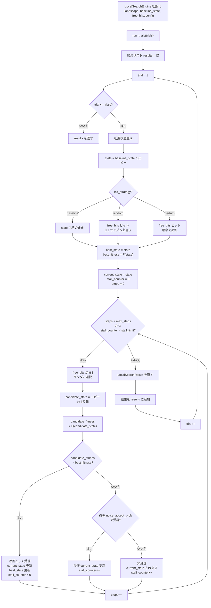
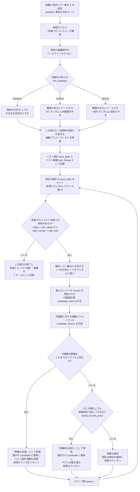
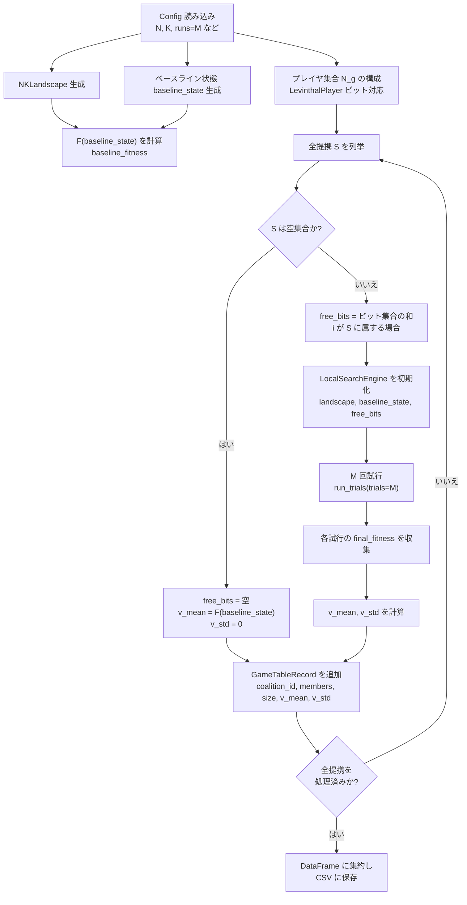

# 詳細設計（Levinthal 1997 シナリオ）

## 1. LocalSearchConfig / Engine（ローカル探索仕様）

```text
@dataclass
class LocalSearchConfig:
    max_steps: int
    stall_limit: int
    noise_accept_prob: float
    init_strategy: Literal['random','baseline','perturb']
    rng_seed: int | None
```

- `stall_limit`: 連続して改善が起きないステップ数（patience）の上限。
- baseline 形態そのものは `LocalSearchEngine` の引数として与える。
- `LocalSearchEngine` 引数:
  - `landscape: NKLandscape`
  - `free_bits: Sequence[int]`
  - `baseline_state: np.ndarray`
  - `config: LocalSearchConfig`
- `run_trials(trials: int) -> list[LocalSearchResult]`
  - 各試行で以下の `_run_once()` を実行：
    1. 初期状態生成:
       - `state = baseline_state` をコピー。
       - `init_strategy='random'` の場合、`free_bits` に属するビットのみ 0/1 ランダムに上書き。
       - `init_strategy='perturb'` の場合、`free_bits` に属するビットを確率 `perturb_prob` で反転。
    2. 反復ステップ:
       - ステップ上限 `max_steps` と `stall_limit` に達するまでループ。
       - 各ステップで:
         - `j` を `free_bits` からランダムに選択。
         - 1 ビット反転案 `candidate_state` を生成し、`candidate_fitness = F(candidate)` を計算。
         - これまでのベスト `best_fitness` と比較し、`candidate_fitness > best_fitness` なら改善として受理。
         - 改善でない場合でも、確率 `noise_accept_prob` でノイズ受容として受理可能。
         - 受理した場合は `current_state` を更新し、改善なら `best_state/best_fitness` を更新、改善が無ければ `stall_counter++`。
         - 非受理の場合も `stall_counter++`。
    3. 停止時に `LocalSearchResult(final_state=current_state, final_fitness=best_fitness, best_fitness=best_fitness, steps=steps)` を返す。

### 1.1 LocalSearchEngine 探索フロー（詳細フローチャート）

上記のローカル探索アルゴリズム（`run_trials` / `_run_once`）を、探索の流れにフォーカスしてフローチャートとして表す。



この図は、「1 試行あたりの状態初期化 → ビット選択 → 1 ビット反転提案 → 受理判定 → 停止条件チェック」のループ構造と、`run_trials` で複数試行分の結果を集約する流れを明示している。

### 1.2 LocalSearchEngine 探索フロー（意味的フローチャート）

同じアルゴリズムを、Levinthal (1997) の「組織進化モデル」の文脈で意味的に読み替えたフローチャートは次のとおり。



この意味的フローチャートでは、ビット列の 0/1 操作を「方針・ルールなどの設計レバーの ON/OFF」として解釈し、
- `max_steps` は「改善プロジェクトに割り当てる期間・予算の上限」、
- `stall_limit` は「しばらく成果が出なければ打ち切る」というマネジメント上の忍耐限度、
- `noise_accept_prob` は「一時的な悪化を許容してでも探索を続ける姿勢（試行錯誤の度合い）」
に対応するものとして読めるようにしている。

## 2. v(S) 評価・ゲームテーブル生成

- プレイヤ:
  - デフォルト: プレイヤ = ビット = インデックス i（`LevinthalPlayer(player_id=str(i), bits=[i])`）。
  - 拡張として、複数ビットを 1 プレイヤに割り当てることも可能（`bits` を複数要素に）。
- 提携評価:
  - `LevinthalGameTableBuilder.build_table(max_size=None)` の内部で、すべての提携 S（またはサイズ制限付き）を列挙。
  - 各提携 S について `free_bits = ⋃_{i∈S} bits(i)` とし、`LocalSearchEngine.run_trials(trials=M)` を呼び出す。
  - 各試行の `final_fitness`（= 探索中に到達したベスト F 値）を収集し、平均を v_mean、標準偏差を v_std として算出。
  - 空提携（S=∅）については F(baseline_x) を v_mean とし、v_std=0 とする。
- テーブル出力:
  - 各提携に対して `GameTableRecord` を生成し、`notes` に `scenario=levinthal1997;N=...;K=...;trials=M` 等のメタ情報を埋め込む。

### 2.1 ゲームテーブル生成フロー（フローチャート）

Levinthal シナリオでのゲームテーブル生成処理をフローチャートとして表すと、以下のようになる。



これにより、「どのビット集合 S に設計権限を与えたときに、局所探索の結果としてどの程度性能を引き上げられるか」をゲームテーブルとして一覧化できる。

## 3. Config / Pipeline との対応

- `config/levinthal1997_baseline.yml`:
  - `scenario.type = levinthal1997`
  - `landscape`: N, K, seeds。
  - `search`: {max_steps, stall_limit, noise_accept_prob, baseline_state}。
  - `game_table`: {runs: M}（ここで runs を各提携 S の試行回数 M と解釈）。
- `ExperimentConfig` / `LevinthalSettings`:
  - `LevinthalSettings` に `max_steps, stall_limit, noise_accept_prob, init_strategy, perturb_prob, baseline_state, players` を保持。
- `run_experiment` の Levinthal 分岐:
  - `NKLandscape.from_random(...)` でランドスケープ生成。
  - baseline_state 文字列を numpy array に変換（長さ N）。
  - プレイヤ集合はデフォルトで 1:1 ビット対応（設定があれば上書き）。
  - `LevinthalGameTableBuilder` を用いてゲームテーブル CSV を生成。

## 4. 実世界での読み替え

- ローカル探索で扱う各ビットは、現実の組織設計における「方針・ルール・構造選択（Yes/No）」に対応する。
- プレイヤ集合 N_g は「設計レバーの集まり」であり、提携 S は「そのレバー群に自由に手を入れられるチーム／役割」を意味する。
- v(S) は、S に与えられた設計権限のもとで、単一組織がどこまで山を登れるか（適応できるか）の期待値として解釈できる。

## 5. テスト戦略

- `poetry run nk-games run --config config/levinthal1997_baseline.yml`
- 期待: `outputs/tables/levinthal1997_baseline.csv` が生成され、`size=0..N` のエントリを含む。
- 手動チェック: baseline state だけの場合（空提携）は baseline フィットネスに一致する。
